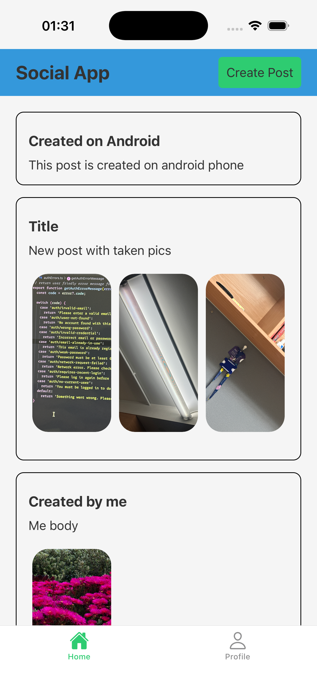
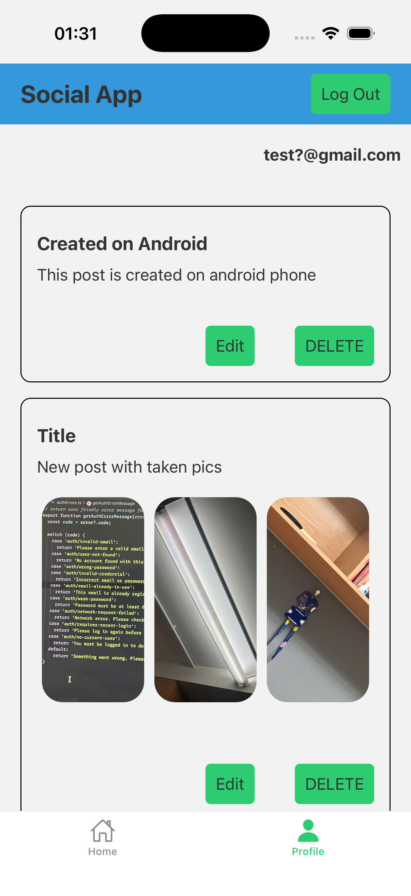
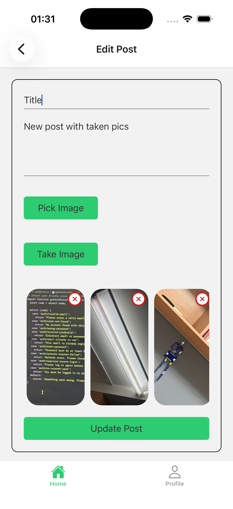
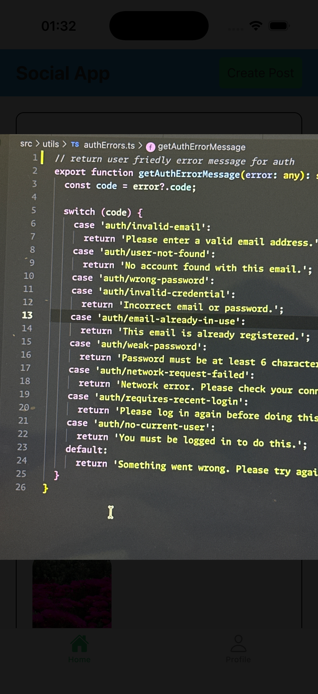

# Mini Social Feed App
---
A cross-platform mobile app built with React Native and Firebase that allows users to authenticate, create and view posts in a simple social feed, and manage their own posts from a profile tab.

<p float="left">
    
    
    
    
</p>


## Purpose

This project was built to practice building a real-world mobile application using React Native, TypeScript, and Firebase.  
The goal was to move beyond tutorials and implement a complete MVP flow including authentication, database integration, and clean app architecture.

## Features

- User authentication with Firebase Auth
- Create and view posts in a real-time feed
- Persistent login state
- Firestore-backed data storage
- Cross-platform support (iOS & Android)

## Tech Stack


- React Native (Expo)
- TypeScript
- Firebase Authentication
- Firebase Firestore
- React Navigation
- Platform: iOS & Android


## Running the App

1. Clone the repository:
   ```bash
   git clone https://github.com/htetooyan-i/mini-social-feed-app.git

2. Navigate to the project directory:
    ```bash
    cd mini-social-feed-app

3. Install dependencies:
    npm install

4. Start the development server:
    npx expo start

5. Run the app on:
    * iOS Simulator, or
    * Android Emulator, or
    * A physical device using the Expo Go app

> ⚠️  Note: This project uses Firebase. A Firebase configuration is required to run the app.  
> Firebase credentials are not included in this repository for security reasons.